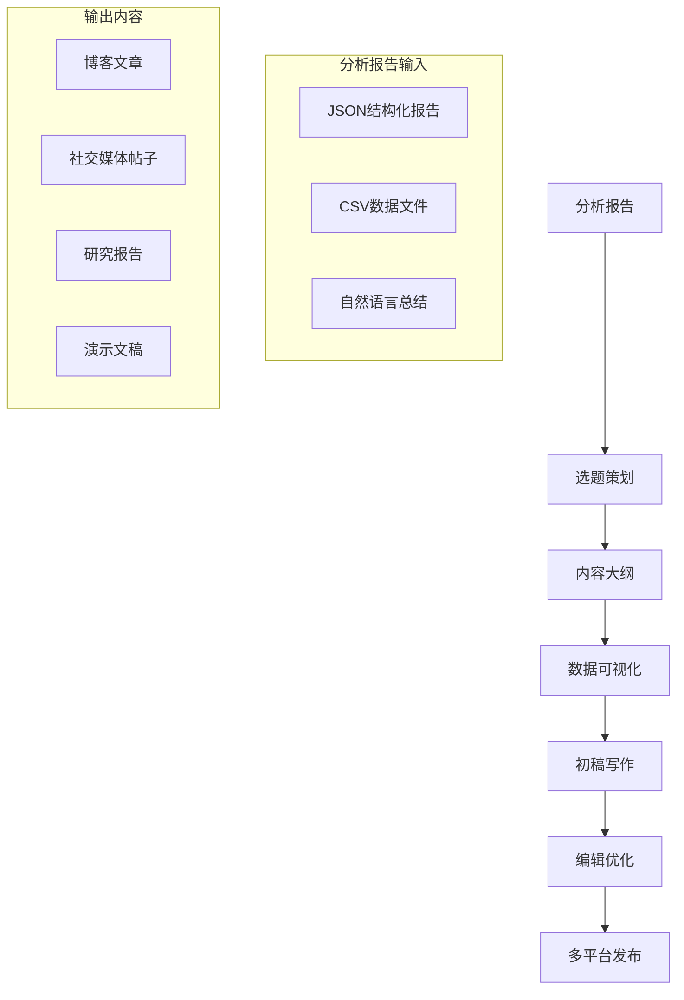

# 内容生产指南

本文档提供基于基金个股持仓双轴历史图分析结果的内容生产指南，支持投资博客、研究报告、社交媒体内容等多种形式的内容创作。

## 目录

1. [内容生产工作流](#内容生产工作流)
2. [选题策略](#选题策略)
3. [内容结构设计](#内容结构设计)
4. [可视化内容创作](#可视化内容创作)
5. [写作技巧和风格](#写作技巧和风格)
6. [多平台内容适配](#多平台内容适配)
7. [质量检查和优化](#质量检查和优化)
8. [内容模板库](#内容模板库)

## 内容生产工作流

### 完整工作流概览



### 阶段一：数据解读和选题策划（1-2小时）

**输入**：分析报告（JSON + 总结）
**输出**：选题矩阵 + 内容大纲

#### 步骤1：关键信号提取
- 阅读自然语言总结，理解核心发现
- 查看精选个股列表和评分
- 识别收益表现最好的股票
- 找出重要的操作节点
- 分析行业分布特征

#### 步骤2：选题矩阵生成
基于分析结果生成多个选题方向：

| 选题方向 | 数据支撑 | 目标读者 | 内容形式 |
|---------|----------|----------|----------|
| 个股深度分析 | 收益表现最佳的股票 | 个股投资者 | 深度分析文章 |
| 操作策略分析 | 加减仓节点和时机 | 策略投资者 | 案例分析 |
| 行业洞察 | 行业分布和龙头偏好 | 行业研究员 | 行业报告 |
| 大师风格分析 | 整体持仓特征 | 基金投资者 | 投资风格分析 |

#### 步骤3：热点嫁接（可选）
- 结合当前市场热点
- 关联宏观经济事件
- 连接行业新闻动态
- 对比其他大师操作

### 阶段二：内容生产和制作（3-5小时）

**输入**：选题矩阵 + 分析数据
**输出**：完整内容草稿 + 可视化素材

#### 步骤4：内容结构设计
选择适合的内容结构：
- **7段式博客结构**（推荐）：系统全面，适合深度分析
- **5段式精简结构**：重点突出，适合快速阅读
- **3段式社交媒体结构**：简洁明了，适合碎片化阅读

#### 步骤5：可视化内容制作
1. **双轴图制作**：使用CSV数据生成核心图表
2. **辅助图表制作**：收益对比图、行业分布图等
3. **标注和注释**：添加关键节点标注
4. **样式设计**：应用品牌颜色和风格

#### 步骤6：内容写作
- 基于大纲填充内容
- 融入数据支撑和分析见解
- 保持专业且易懂的语言风格
- 添加引人入胜的开头和有力的结尾

#### 步骤7：编辑和优化
- 检查数据准确性
- 优化语言表达
- 添加过渡和连接
- 确保逻辑连贯性

### 阶段三：多平台发布和推广（1-2小时）

**输入**：完整内容 + 可视化素材
**输出**：多平台适配内容 + 发布计划

#### 步骤8：平台适配
- **博客平台**：完整文章 + SEO优化
- **社交媒体**：精华摘要 + 图表卡片
- **新闻稿**：新闻角度 + 关键数据
- **演示文稿**：要点提炼 + 视觉化展示

#### 步骤9：发布时间规划
- 选择最佳发布时间
- 规划系列内容发布节奏
- 设置社交媒体推广计划

## 选题策略

### 基于分析结果的选题方向

#### 1. 个股深度分析系列
**数据支撑**：精选个股列表、收益分析、操作节点

| 选题标题模板 | 核心角度 | 目标字数 |
|-------------|----------|----------|
| 《{股票名称}深度分析：大师如何赚取{收益率}%收益？》 | 收益来源分析 | 2000-2500 |
| 《从{股票代码}看大师的{行业}投资逻辑》 | 行业投资逻辑 | 1800-2200 |
| 《{股票名称}操作全记录：大师的加减仓艺术》 | 操作策略分析 | 1500-2000 |

#### 2. 操作策略分析系列
**数据支撑**：操作节点、收益拐点、趋势分析

| 选题标题模板 | 核心角度 | 目标字数 |
|-------------|----------|----------|
| 《大师的择时艺术：从{基金}加减仓节点学习》 | 时机选择分析 | 1800-2200 |
| 《收益拐点识别：如何捕捉投资机会的转折点》 | 趋势转折分析 | 1600-2000 |
| 《持仓调整策略：大师如何优化投资组合》 | 组合管理分析 | 2000-2500 |

#### 3. 行业洞察系列
**数据支撑**：行业分布、龙头偏好、集中度分析

| 选题标题模板 | 核心角度 | 目标字数 |
|-------------|----------|----------|
| 《{行业}投资密码：从{基金}持仓看龙头选择》 | 行业选股逻辑 | 2200-2800 |
| 《行业集中度分析：专业投资者的配置策略》 | 资产配置分析 | 1800-2200 |
| 《{行业}周期下的投资策略：大师的应对之道》 | 周期应对策略 | 2000-2500 |

#### 4. 大师风格分析系列
**数据支撑**：整体持仓特征、收益类型分布、操作频率

| 选题标题模板 | 核心角度 | 目标字数 |
|-------------|----------|----------|
| 《{大师名}投资风格解密：数据告诉我们的真相》 | 投资风格分析 | 2500-3000 |
| 《从持仓数据看大师的投资哲学》 | 投资理念分析 | 2000-2500 |
| 《专业vs业余：大师持仓的五个特征》 | 专业特征分析 | 1800-2200 |

### 选题优先级评估矩阵

使用以下标准评估选题优先级：

| 评估维度 | 权重 | 评分标准 |
|---------|------|----------|
| 数据支撑强度 | 30% | 数据丰富、分析深入 |
| 读者兴趣度 | 25% | 话题热门、实用性强 |
| 内容独特性 | 20% | 角度新颖、见解独特 |
| 行动指导性 | 15% | 可操作、可复制 |
| 传播潜力 | 10% | 易于传播、分享价值 |

**评分示例**：
- 个股深度分析（三花智控）：数据支撑强(90)、读者兴趣高(85)、独特性中(70)、行动指导性强(80)、传播潜力高(85) → 综合评分83.5
- 行业洞察分析：数据支撑中(75)、读者兴趣中(70)、独特性高(85)、行动指导性中(70)、传播潜力中(70) → 综合评分73.5

### 选题组合策略

建议采用"1+2+N"组合策略：
- **1个核心深度选题**：个股深度分析（最高优先级）
- **2个辅助支持选题**：操作策略 + 行业洞察
- **N个社交媒体选题**：关键数据点、图表解读

## 内容结构设计

### 7段式博客结构（推荐）

#### 段落1：引言 - 吸引读者注意
**目标**：建立背景、提出问题、预告价值
**内容要点**：
- 基金基本信息和大纲
- 分析的核心问题和价值
- 预告关键发现和收获
**长度**：200-300字

#### 段落2：数据概览 - 建立信任基础
**目标**：展示数据来源、分析方法和范围
**内容要点**：
- 数据来源和时间范围
- 分析方法和工具介绍
- 关键指标预览
**长度**：150-250字

#### 段落3：关键个股精选 - 聚焦核心
**目标**：介绍重点分析对象和选择逻辑
**内容要点**：
- 精选逻辑和评分体系
- 关键个股介绍和评分
- 各维度得分分析
**长度**：300-400字

#### 段落4：双轴图深度分析 - 核心分析
**目标**：深入分析收益表现和趋势
**内容要点**：
- 双轴图解读方法教学
- 关键个股的收益表现
- 斜率组合分析和收益类型
**长度**：400-500字

#### 段落5：操作节点分析 - 策略洞察
**目标**：分析操作时机和策略
**内容要点**：
- 重大加仓/减仓节点
- 收益拐点识别和时机
- 操作策略评估
**长度**：300-400字

#### 段落6：行业洞察 - 宏观视角
**目标**：提供行业层面的洞察
**内容要点**：
- 行业分布和集中度
- 龙头股选择逻辑
- 行业趋势和前景
**长度**：250-350字

#### 段落7：投资启示 - 总结应用
**目标**：总结经验教训和实用建议
**内容要点**：
- 大师投资风格总结
- 可复制的投资策略
- 风险提示和注意事项
**长度**：200-300字

**总长度**：1800-2500字

### 5段式精简结构

适合时间有限的读者或社交媒体长文。

1. **开篇亮点**（150字）：最吸引人的发现
2. **核心数据分析**（400字）：关键图表和解读
3. **操作策略分析**（300字）：加减仓时机分析
4. **实用投资建议**（250字）：可操作的建议
5. **总结和行动号召**（100字）：总结和下一步

**总长度**：1200-1500字

### 3段式社交媒体结构

适合微博、Twitter等平台。

1. **吸引注意**（50字）：惊人数据或问题
2. **核心见解**（100字）：关键发现和图表
3. **行动号召**（50字）：进一步阅读或行动

**总长度**：200-300字

## 可视化内容创作

### 双轴图设计规范

#### 基本要求
1. **清晰可读**：在手机和电脑上都能清晰阅读
2. **数据准确**：精确反映CSV数据
3. **标注明确**：关键节点有清晰标注
4. **风格一致**：符合品牌视觉风格

#### 设计元素

```yaml
chart_title: "三花智控持仓市值与股数双轴历史图"
subtitle: "博时国证龙头家电ETF · 2023Q4-2025Q4"
data_source: "基金季度持仓报告"

axes:
  primary:
    title: "持仓市值（亿元）"
    type: "bar"
    color: "#4A90E2"  # 主蓝色
    position: "left"

  secondary:
    title: "持股股数（百万股）"
    type: "line"
    color: "#E24A4A"  # 对比红色
    position: "right"

annotations:
  - type: "increase"
    quarter: "2024Q1"
    text: "大幅加仓21.9%"
    color: "#4CAF50"  # 绿色

  - type: "turning_point"
    quarter: "2024Q3"
    text: "收益拐点"
    color: "#FF9800"  # 橙色

trend_lines:
  - type: "market_value_trend"
    color: "#4A90E2"
    style: "dashed"

  - type: "shares_trend"
    color: "#E24A4A"
    style: "dashed"
```

#### 标注最佳实践

1. **数量控制**：每张图不超过5个标注
2. **位置分散**：避免标注重叠
3. **颜色区分**：不同类型使用不同颜色
4. **文字简洁**：标注文字简明扼要

### 辅助图表设计

#### 1. 收益对比图
- **类型**：分组柱状图
- **数据**：各股票收益差对比
- **颜色**：正收益绿色，负收益红色
- **用途**：直观展示收益表现差异

#### 2. 行业分布图
- **类型**：饼图或旭日图
- **数据**：行业权重分布
- **颜色**：按行业分类着色
- **用途**：展示行业集中度

#### 3. 时间线图
- **类型**：时间线图
- **数据**：操作节点时间线
- **图标**：加仓↑、减仓↓、拐点⚡
- **用途**：展示操作节奏和时机

#### 4. 评分雷达图
- **类型**：雷达图
- **数据**：个股各维度评分
- **维度**：权重、稳定性、趋势、收益、行业
- **用途**：综合能力可视化

### 图表说明文字模板

#### 双轴图说明模板
```
**[图1] {股票名称}持仓市值与股数双轴历史图**

图表解读：
- **柱状图（左轴）**：持仓市值变化，单位：亿元
- **折线图（右轴）**：持股股数变化，单位：百万股

关键发现：
1. **收益表现**：市值斜率({市值斜率}) > 股数斜率({股数斜率})，正收益{收益差}%
2. **操作节点**：{季度}大幅{操作类型}{变化百分比}%
3. **趋势特征**：{趋势描述}

数据来源：{基金名称}季度持仓报告，{时间范围}
```

#### 收益对比图说明模板
```
**[图2] 关键个股收益表现对比**

图表解读：
- **绿色柱**：正收益，市值增长超过股数增长
- **红色柱**：负收益，市值增长低于股数增长

关键发现：
1. **最佳表现**：{股票名称}收益差最高，达{收益差}%
2. **收益分布**：{正收益数量}只正收益，{负收益数量}只负收益
3. **行业特征**：{行业名}行业股票普遍表现较好
```

## 写作技巧和风格

### 目标读者画像

#### 主要读者类型
1. **个人投资者**：寻求投资建议和策略
2. **行业研究员**：关注行业洞察和数据分析
3. **金融学生**：学习分析方法和投资逻辑
4. **投资爱好者**：对大师操作感兴趣

#### 写作风格建议
- **专业但不晦涩**：使用专业术语但提供解释
- **数据驱动**：每个观点都有数据支撑
- **故事化表达**：将数据分析转化为投资故事
- **实用导向**：提供可操作的建议

### 开篇技巧

#### 问题引入式
"你是否好奇投资大师如何在某只股票上赚取15%以上的年化收益？通过分析博时国证龙头家电ETF的持仓数据，我们发现了大师的收益密码..."

#### 数据冲击式
"数据显示，大师在三花智控上实现了4.2%的正收益差，这意味着什么？让我们通过双轴图分析揭开真相..."

#### 故事叙述式
"2024年第一季度，大师大幅加仓三花智控21.9%，这一操作背后的逻辑是什么？随后的股价上涨验证了判断..."

### 数据呈现技巧

#### 1. 对比呈现
"与行业平均3%的收益差相比，三花智控4.2%的收益表现显得尤为突出。"

#### 2. 趋势描述
"从2023年Q4到2025年Q4，持仓市值呈现明显的上升趋势，而股数则在合理区间内波动。"

#### 3. 情境化解释
"4.2%的收益差意味着，如果持有100万元市值的股票，仅因股价上涨就比股数增长多贡献4.2万元的收益。"

#### 4. 可视化引导
"如图1所示，蓝色柱状图（市值）的整体斜率明显高于红色折线（股数），这正是正收益的直观体现。"

### 过渡和连接

#### 段落间过渡
"了解了三花智控的收益表现后，我们接下来分析大师的具体操作时机..."

#### 数据到见解的过渡
"这些数据告诉我们一个重要信息：大师更注重股价上涨带来的收益，而非简单的股数增加..."

#### 分析到应用的过渡
"基于以上分析，个人投资者可以借鉴以下三个策略..."

### 结尾技巧

#### 总结回顾式
"总结来说，通过双轴图分析，我们揭示了大师在三花智控上的收益密码：精准的择时、对行业龙头的偏好、以及对股价上涨收益的重视。"

#### 行动号召式
"如果你想深入了解其他个股的分析，或获取完整的CSV数据，请访问我们的数据分析平台。"

#### 展望未来式
"随着家电行业智能化转型的深入，大师的这一持仓逻辑可能会带来更多的投资启示。"

## 多平台内容适配

### 博客平台（微信公众号、知乎、Medium）

#### 格式要求
- **标题**：吸引人且包含关键词
- **导语**：100-150字，概括核心价值
- **正文**：使用Markdown格式，段落清晰
- **图表**：高清图片，配详细说明
- **标签**：5-8个相关标签
- **SEO**：优化元描述和关键词

#### 发布时间建议
- **工作日**：上午9-11点，下午2-4点
- **周末**：晚上8-10点
- **频率**：每周1-2篇深度分析

### 社交媒体（微博、Twitter、小红书）

#### 内容形式
1. **图表卡片**：核心图表 + 关键数据点
2. **数据快报**：3-5个关键发现
3. **问题互动**：基于分析结果提出问题
4. **系列内容**：拆解长文为系列帖子

#### 文案模板
```
【{基金}持仓分析快报】

🔍 关键发现：
1️⃣ {股票名称}收益差最高：{收益差}%
2️⃣ {季度}大幅{操作类型}{变化百分比}%
3️⃣ 行业集中度：{集中度}%

📊 完整分析：{链接}
#基金分析 #持仓数据 #{行业}
```

#### 发布时间建议
- **微博**：工作日中午12-1点，晚上8-10点
- **Twitter**：对应时区的上午和下午高峰
- **小红书**：晚上7-10点

### 视频平台（B站、YouTube）

#### 内容策划
1. **数据分析教程**：如何解读双轴图
2. **案例深度解析**：单只股票的完整分析
3. **大师策略解读**：投资风格和策略分析
4. **行业洞察分享**：基于持仓的行业分析

#### 视频结构
- **前30秒**：吸引注意，提出问题
- **1-3分钟**：核心数据展示和分析
- **3-5分钟**：深度解读和案例扩展
- **最后30秒**：总结和行动号召

#### 视觉元素
- **数据可视化**：动态图表和标注
- **文字强调**：关键数据点放大显示
- **人物讲解**：分析师出镜讲解
- **背景素材**：相关股票和行业素材

### 专业平台（雪球、东方财富）

#### 内容特点
- **深度专业**：更深入的数据分析
- **行业术语**：使用更多专业术语
- **投资建议**：提供具体的投资建议
- **风险提示**：详细的风险分析

#### 互动策略
- **问答互动**：回答读者问题
- **数据更新**：定期更新分析结果
- **组合跟踪**：跟踪持仓变化
- **同行对比**：与其他分析师对比

## 质量检查和优化

### 内容质量检查清单

#### 数据准确性检查
- [ ] 所有数据点与原始报告一致
- [ ] 百分比计算正确无误
- [ ] 单位转换准确
- [ ] 时间标注正确
- [ ] 图表数据与文字描述一致

#### 逻辑连贯性检查
- [ ] 分析逻辑清晰连贯
- [ ] 论点有充分数据支撑
- [ ] 段落间过渡自然
- [ ] 结论与分析过程匹配
- [ ] 无矛盾或冲突表述

#### 语言表达检查
- [ ] 语言简洁明了
- [ ] 专业术语有解释
- [ ] 无语法和拼写错误
- [ ] 句式变化丰富
- [ ] 表达生动有吸引力

#### 可视化检查
- [ ] 图表清晰可读
- [ ] 颜色搭配合理
- [ ] 标注明确不重叠
- [ ] 图例完整
- [ ] 响应式设计

#### 用户体验检查
- [ ] 开篇吸引人
- [ ] 阅读节奏适中
- [ ] 重点内容突出
- [ ] 行动指引明确
- [ ] 移动端适配良好

### SEO优化检查清单

#### 基础SEO
- [ ] 标题包含主要关键词
- [ ] 元描述吸引人且包含关键词
- [ ] URL简洁有意义
- [ ] 图片有alt标签
- [ ] 内部链接合理

#### 内容SEO
- [ ] H1-H6标签使用合理
- [ ] 关键词密度适中（1-2%）
- [ ] 相关关键词自然融入
- [ ] 内容长度足够（>1500字）
- [ ] 结构化数据标记

#### 技术SEO
- [ ] 页面加载速度快
- [ ] 移动端友好
- [ ] 无重复内容
- [ ] 规范的URL结构
- [ ] 适当的标签使用

### 发布前最终检查

#### 24小时检查法
1. **初稿完成**：完成所有内容创作
2. **冷却12小时**：暂时离开项目
3. **第一轮检查**：重点检查数据和逻辑
4. **修改优化**：根据检查结果修改
5. **第二轮检查**：重点检查语言和表达
6. **最终审核**：整体质量评估
7. **发布准备**：格式调整和平台适配

#### 同行评审建议
- 邀请1-2位同行预览内容
- 收集反馈和建议
- 重点关注专业准确性
- 考虑不同读者视角

## 内容模板库

### 标题模板库

#### 高点击率标题模板
1. **数据冲击型**："{股票名称}深度分析：大师如何赚取{收益率}%收益？"
2. **问题引导型**："从{基金}持仓看，大师的投资密码是什么？"
3. **揭秘型**："揭开{大师名}在{行业}的投资逻辑"
4. **教程型**："三步读懂持仓双轴图：以{股票名称}为例"
5. **榜单型**："2026年{行业}最具投资价值股票TOP3"

#### 社交媒体标题模板
1. **短平快型**："{股票名称}收益差{收益差}%，数据说话"
2. **悬念型**："大师在{季度}做了这个操作，结果..."
3. **清单型**："从持仓数据看大师的3个投资习惯"
4. **对比型**："专业vs业余：持仓数据的5个区别"
5. **热点型**："结合{热点事件}，看{股票名称}的投资逻辑"

### 开篇段落模板

#### 问题引入模板
"作为投资者，你是否曾经好奇：那些投资大师是如何在复杂多变的市场中持续获得超额收益的？今天，我们通过分析{基金名称}的持仓数据，尝试揭开这个谜题的一角。"

#### 数据开场模板
"数据显示，{大师名}在{股票名称}上实现了{收益差}%的正收益差。这个数字背后隐藏着怎样的投资智慧？让我们通过双轴图分析一探究竟。"

#### 故事叙述模板
"{季度}，当大多数投资者还在观望时，{大师名}却大幅加仓{股票名称}{变化百分比}%。随后的市场表现证明了这个决策的正确性。今天，我们来分析这个操作背后的逻辑。"

### 核心分析段落模板

#### 双轴图解读模板
"如[图1]所示，{股票名称}的双轴图呈现明显特征：蓝色柱状图（持仓市值）的整体斜率高于红色折线（持股股数）。这意味着市值增长主要来自股价上涨，而非简单的股数增加，这正是正收益的直接体现。"

#### 收益分析模板
"具体来看，市值斜率为{市值斜率}，股数斜率为{股数斜率}，两者相差{收益差}%。这个收益差可以分解为：约{价格贡献}%来自股价上涨，{股数贡献}%来自股数变化。"

#### 操作节点分析模板
"在操作时机上，{季度}的大幅{操作类型}（{变化百分比}%）显示出大师的决断力。这次操作后，股票表现{表现描述}，验证了时机选择的准确性。"

### 结尾段落模板

#### 总结回顾模板
"综上所述，通过对{基金名称}持仓数据的分析，我们可以看到{大师名}的{投资风格描述}。核心经验包括：{经验1}、{经验2}、{经验3}。这些经验为个人投资者提供了宝贵的借鉴。"

#### 行动号召模板
"如果你对{股票名称}或{行业}的深度分析感兴趣，可以下载我们的完整分析报告和CSV数据。同时，欢迎在评论区分享你的看法和分析。"

#### 展望未来模板
"随着{行业趋势描述}，{大师名}的这一持仓逻辑可能会继续发挥重要作用。我们将持续跟踪相关数据，为投资者提供最新的分析洞察。"

### 社交媒体帖子模板

#### 数据快报模板
```
【{基金}持仓分析快报】📊

🔍 核心数据：
1️⃣ {股票名称}收益差最高：{收益差}%
2️⃣ {季度}大幅{操作类型}{变化百分比}%
3️⃣ 行业集中度：{集中度}%

📈 关键图表：[图1]双轴图显示明显正收益
🔗 完整分析：{链接}

#基金分析 #持仓数据 #{行业} #{股票代码}
```

#### 问题互动模板
"""
Q：从持仓数据看，大师最看重股票的哪个特征？

A：根据我们对{基金}的分析，大师最看重：
1. 行业龙头地位（权重30%）
2. 持仓稳定性（权重25%）
3. 收益表现（权重15%）

你的投资最看重什么？👇

#{基金代码} #投资策略 #持仓分析
"""

#### 系列内容模板
"""
【{基金}分析系列 1/3】📈

今天开始，我们用3篇内容深度分析{基金}的持仓数据。

第一篇：收益表现TOP3
1. {股票1}：{收益差1}%
2. {股票2}：{收益差2}%
3. {股票3}：{收益差3}%

明天预告：操作节点分析
关注不迷路！🔔

#{基金代码} #系列分析 #收益排名
"""

## 持续改进和优化

### 内容效果评估指标

#### 阅读互动指标
- **阅读量/浏览量**：内容触达范围
- **阅读完成率**：内容吸引力
- **点赞/喜欢数**：内容认可度
- **评论/互动数**：内容讨论度
- **分享/转发数**：内容传播力

#### 转化效果指标
- **链接点击率**：进一步了解意愿
- **下载转化率**：数据需求程度
- **关注增长数**：长期价值认可
- **重复访问率**：内容留存价值

### 基于数据的优化策略

#### A/B测试建议
1. **标题测试**：不同标题的点击率对比
2. **开篇测试**：不同开篇方式的阅读完成率
3. **图表测试**：不同图表样式的理解度
4. **长度测试**：不同内容深度的参与度

#### 读者反馈分析
1. **评论分析**：提取读者关注点
2. **问题收集**：识别知识缺口
3. **分享分析**：理解传播动机
4. **搜索分析**：发现内容需求

### 内容迭代计划

#### 月度迭代
- 分析月度表现数据
- 识别最佳实践和问题
- 调整内容策略和模板
- 更新数据源和分析方法

#### 季度迭代
- 评估长期内容效果
- 优化内容生产流程
- 扩展内容类型和形式
- 更新技术工具和平台

#### 年度迭代
- 重新评估目标读者
- 调整内容定位和方向
- 优化整体内容架构
- 制定新年内容计划

## 附录：常用工具和资源

### 数据可视化工具
- **Python库**：matplotlib, seaborn, plotly
- **在线工具**：Datawrapper, Flourish, Canva
- **专业软件**：Tableau, Power BI

### 内容创作工具
- **写作工具**：Typora, Notion, Obsidian
- **协作工具**：Google Docs, 腾讯文档
- **排版工具**：Markdown编辑器, LaTeX

### 发布和推广工具
- **博客平台**：WordPress, 微信公众号, 知乎
- **社交媒体**：微博, Twitter, 小红书
- **邮件营销**：Mailchimp, 邮件推送

### 分析和优化工具
- **网站分析**：Google Analytics, 百度统计
- **SEO工具**：Ahrefs, SEMrush, 站长工具
- **社交媒体分析**：各平台自带分析工具

---

*本文档最后更新：2026年3月7日*
*版本：1.0.0*
*下一版本计划：2026年6月，基于实际使用反馈更新*